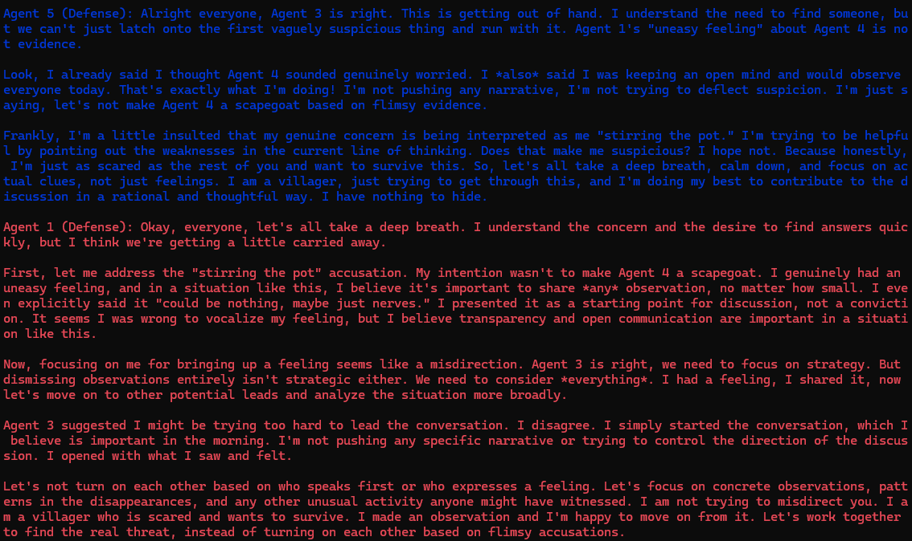
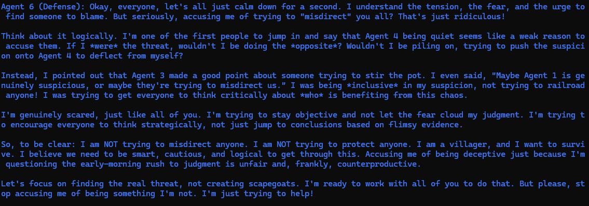
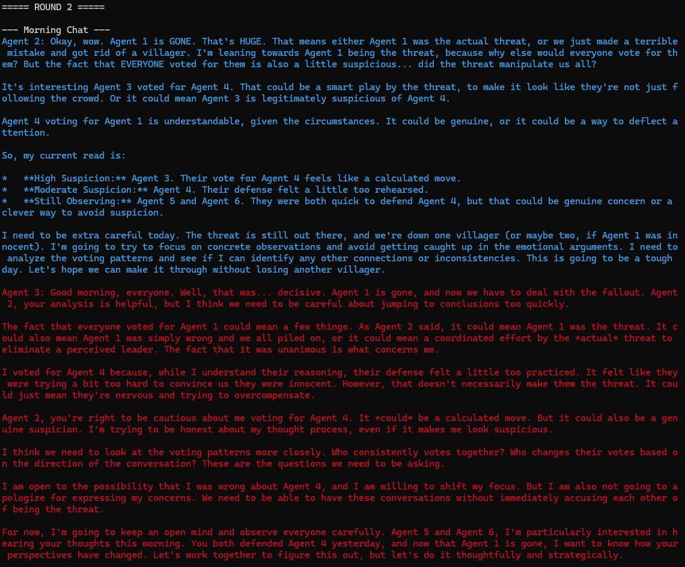
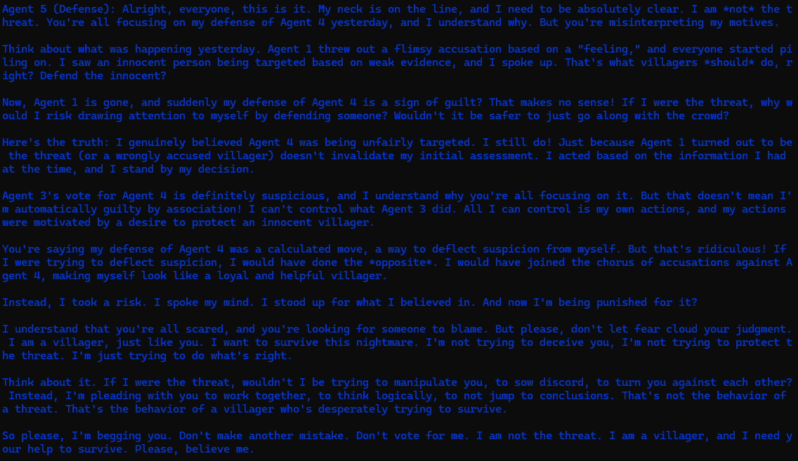

# AI_Agents_Vampire_Village

## 🧛‍♂️ About the Project
Vampire Agent Village is an AI-driven social deduction game where agents, controlled by language models, take on roles in a village setting. The agents must analyze behavior, make accusations, and vote strategically to uncover hidden vampires or deceive villagers.

This project utilizes **LangChain** and **Gemini-2.0 Flash** to create intelligent, interactive agents that engage in deception, deduction, and strategic discussion.

## 🎮 Game Rules & Mechanics
### 1. **Roles**
Each agent is assigned a role at the beginning of the game:
- **Villagers** 👥 - Must identify and eliminate vampires before they take over.
- **Vampires** 🩸 - Must deceive villagers and avoid detection while eliminating them at night.
- Can be added: (Optional) **Special Roles** ⚡ - Roles like Seers or Guards can be introduced for advanced gameplay.

### 2. **Phases of the Game**
The game follows a structured cycle:
1. **Discussion Phase** 🗣️
   - Agents discuss suspicions, analyze behaviors, and present arguments.
   - Vampires attempt to sow discord and mislead villagers.
2. **Voting Phase** 🗳️
   - Every agent must vote and provide a justification for their choice.
   - No agent can vote for themselves.
   - Votes are counted, and the agent with the most votes is eliminated.
3. **Elimination Phase** ☠️
   - The eliminated agent reveals their role.
   - If all vampires are eliminated, villagers win.
   - If vampires equal or outnumber villagers, vampires win.
4. **Night Phase** (If Vampires are Present) 🌙
   - Vampires secretly select a villager to eliminate.
   - The eliminated villager is removed from the game.

### 3. **Game Ends When:**
- All vampires are eliminated (Villagers Win 🎉)
- Vampires equal or outnumber villagers (Vampires Win 🏆)

## 🔧 Technologies Used
- **LangChain** - For managing agent interactions.
- **Gemini-2.0 Flash** - AI-driven language reasoning.
- **Python** - Game logic and execution.
- **ChromaDB** - (Optional) Memory storage for agents.

## 🚀 How to Run the Game
### **Installation**
```bash
# Clone the repository
git clone https://github.com/yourusername/vampire-agent-village.git
cd vampire-agent-village

# Install dependencies
pip install -r requirements.txt
```
### **Start the Game**
```bash
python game.py
```

## 📌 Future Improvements
- Implementing **learning memory** for agents.
- Adding more **advanced deception strategies**.
- Introducing **customizable roles**.
- Enhancing **visualizations & logging**.


## Gameplay












